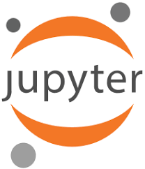

<!--

author:   riadh BEN NESSIB

email:    riadhbennessib@gmail.com

version:  0.0.1

language: fr

script:   javascript resourse url

script:   another javascript resourse url

link:     some css stuff
          and some more css

-->
# Introduction à Python

(c) 2020, par riadh BEN NESSIB

# Les outils de programmation avec python
## Ipython
## Jupyter

## VSCode

## Spyder
<!--
style = "width: 100px;
         border: 10px solid;
         filter: grayscale(50%);"

class = "animated infinite bounce"
-->
